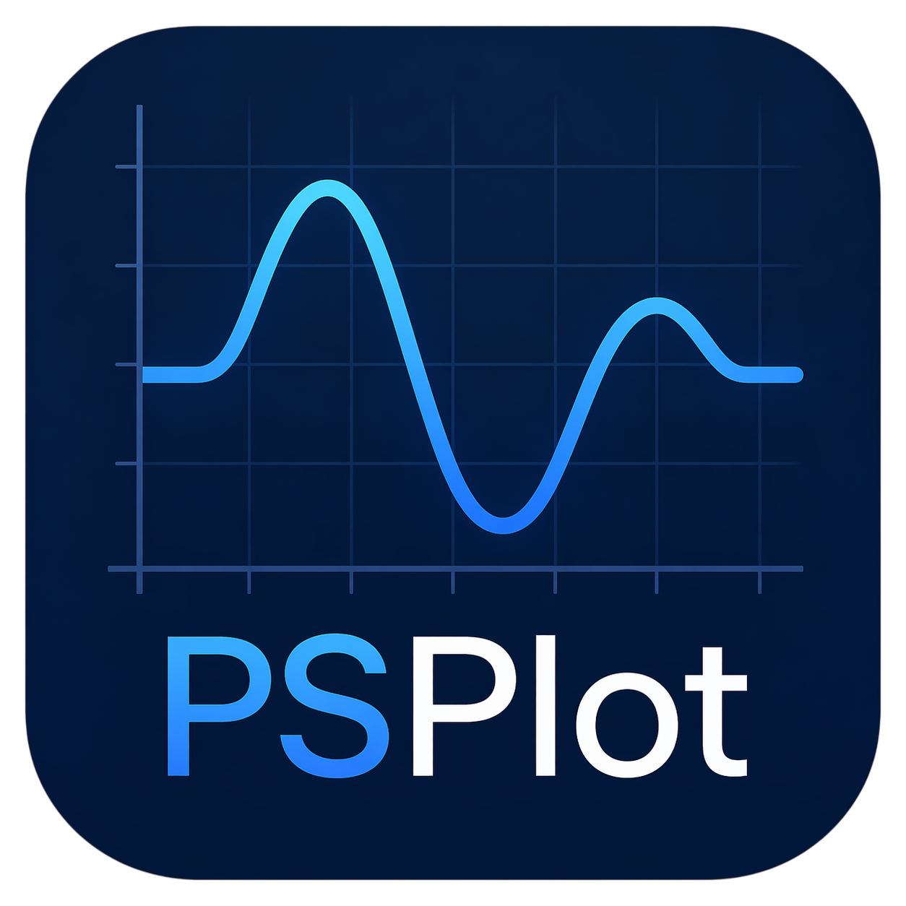
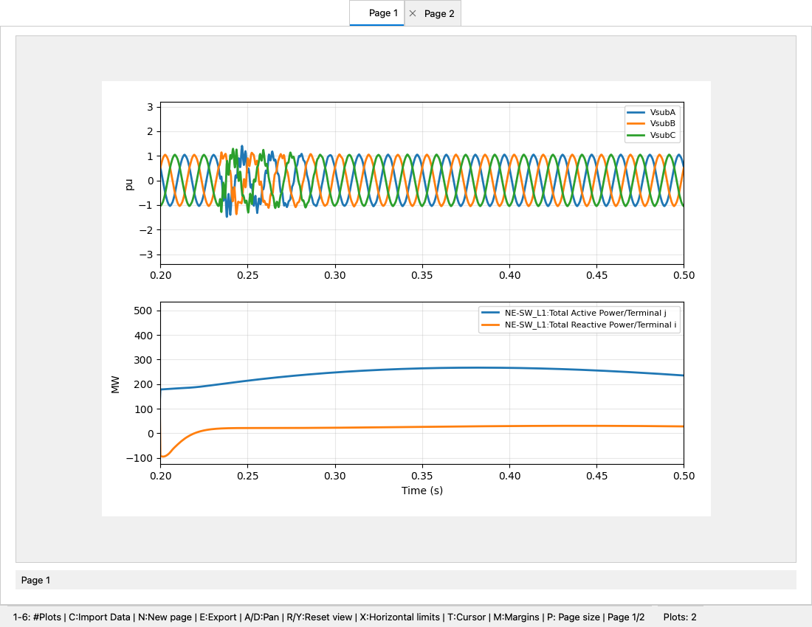
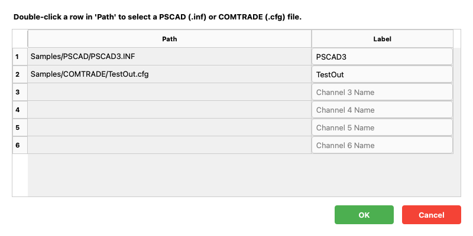
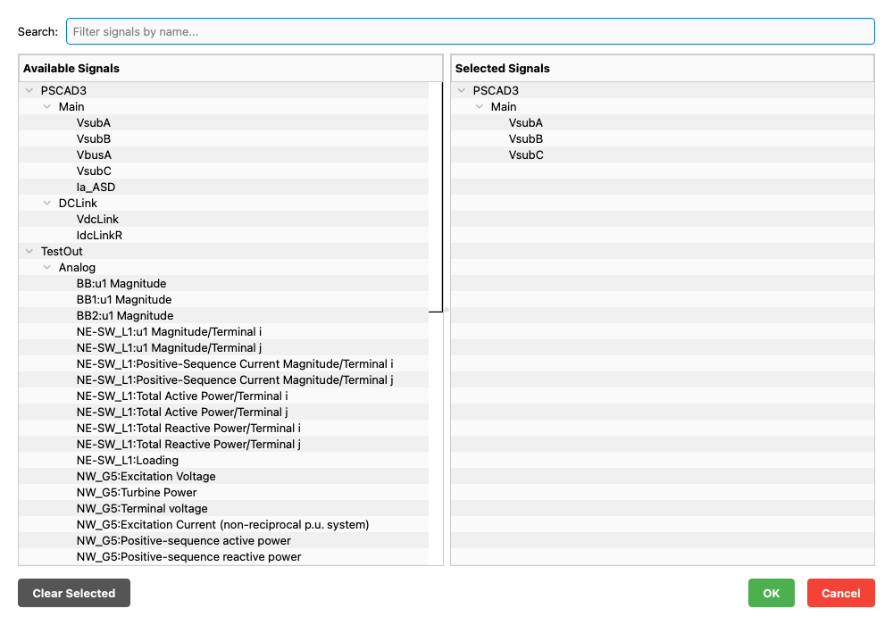
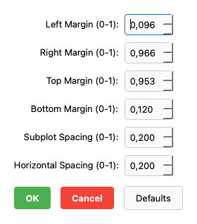
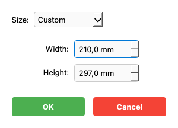

# PSPlot: Power System Signal Analysis Tool





PSPlot is a high-performance, PyQt5-based visualization and analysis tool designed for electrical engineers and researchers. It specializes in processing large-scale transient data from simulation environments (PSCAD) and field recordings (IEEE COMTRADE).

## 🚀 Capabilities

- **Multi-Format Support**: 
  - **PSCAD**: Native support for `.inf` and `.out` file pairs.
  - **IEEE COMTRADE**: Full compatibility with C37.111-1991, 1999, and 2013 standards (ASCII and Binary formats).
  - **CSV**: Import standard CSV files with flexible column mapping.
- **Advanced Visualization**: 
  - Synchronized multi-subplot scrolling and zooming.
  - Interactive measurement cursors (Shortcut: `T`).
- **Quick Scaling Tool**: Right-click any signal to apply real-time scaling factors (e.g., CT/PT ratios) without modifying the raw data.
- **Session Persistence**: Save and reload your workspace configurations (layouts, scaling, and signals) using `.psp` session files.
- **Fieldwork Optimized**: High-contrast UI theme designed for technical audits and on-site analysis (tested at PHR Duri sites).

## 🛠 Installation

PSPlot uses the `uv` package manager for fast, reproducible environment setup.

1. **Clone the repository**:
   ```bash
   git clone https://github.com/irnawan/PSPlot.git
   cd PSPlot
   ```

2. **Setup environment**:
   ```bash
   # Using uv (Recommended)
   uv venv
   uv pip install -r requirements.txt
   ```

38|3. **Dependencies**:
39|    - Python 3.11+
40|    - PyQt5, Matplotlib
41|    - NumPy, SciPy (for transient data processing)
42|    - Pandas (for CSV and Metadata handling)
43|    - Darkdetect (for automated theme sensing)

## 📁 Project Structure

```
PSPlot/
├── pyproject.toml          # Package configuration (build, dependencies, entry point)
├── requirements.txt        # Dependencies for uv/virtualenv setup
├── run.py                  # Application entry point (python run.py)
├── README.md               # This file
│
├── psplot/                 # Main Python package
│   ├── __init__.py
│   ├── plot_canvas.py      # Central canvas with zoom, cursor, signal handler
│   ├── assets/             # Visual resources
│   │   └── PSPlot_icon.png # Application icon
│   ├── core/               # Data models, validation, config, settings
│   ├── gui/                # PyQt5 UI components (MainWindow, dialogs, widgets)
│   ├── managers/           # Interaction logic (zoom, keyboard, page, action)
│   ├── plot_modules/       # Mixin modules (Zoom, Cursor, Signal Handler, Layout)
62|   └── readers/            # Data import (PSCAD, COMTRADE, CSV)
63|│
64|├── tests/                # Unit tests & validation suite
65|├── screenshots/          # Application screenshots for README
66|└── Samples/              # Example data files for testing
67|```

**Key Changes**: All modules reorganized into the `psplot/` package with `pyproject.toml` for modern packaging. Icons and assets moved to `psplot/assets/`. Entry point renamed from `main.py` to `run.py`.

## 📖 How to Use

### 1. Importing Data
Launch the application and click **File > Import Data** (Shortcut: `C`). 
- For PSCAD: Select the `.inf` file.
- For COMTRADE: Select the `.cfg` file.
- For CSV: Select the `.csv` file.



### 2. Signal Explorer
The **Signal Explorer** on the left allows you to:
- Browse signals organized by type (Analog/Digital).
- Drag and drop signals directly into any subplot.
- Right-click for **Quick Scale** (Multiplier/Gain setup).



### 3. Managing Layouts
Double-click a signal in the tree to add it to a new plot, or use keyboard shortcuts to change the window layout instantly.

### 4. Keyboard Shortcuts Reference
Used for rapid analysis during field sessions:

#### Configuration Dialogs
Quickly adjust layouts and prepare reports using dedicated dialogs:

| Margins (M) | Page Size (P) |
| :---: | :---: |
|  |  |
---

| Key | Action |
| :--- | :--- |
| **`T`** | Toggle Measurement Cursors |
| **`1` - `6`** | Change number of subplots (1 to 6) |
| **`A` / `D`** | Pan Left / Right |
| **`R` / `Y`** | Reset Zoom (R = X-Axis, Y = Y-Axis) |
108|**`X`** | Snap/Round X-Axis to Grid |
109|**`C`** | Import Data Dialog |
110|**`*Double-Click*`** | On measurement label (status bar) to **reset cursors** to view |
111|**`N`** | Add a new blank page/canvas |

| **`M`** | Adjust Plot Margins |
| **`P`** | Resize canvas/page dimensions |
| **`Ctrl+Q`** | Exit Application |

---
*Developed by Roni Irnawan, Ph.D. - Universitas Gadjah Mada*